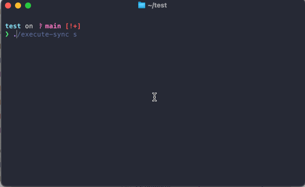
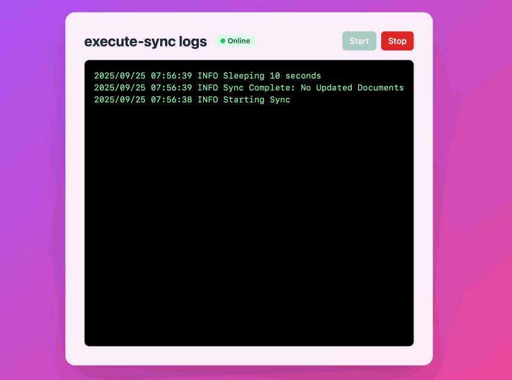
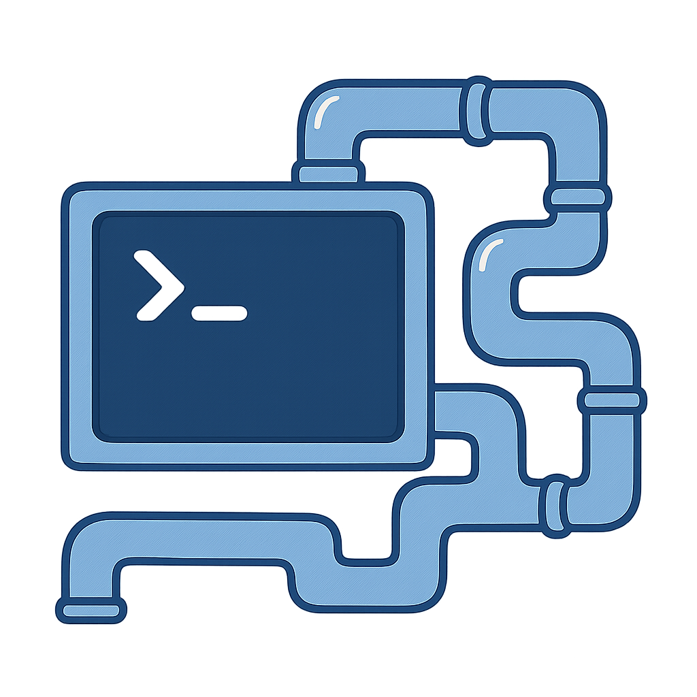
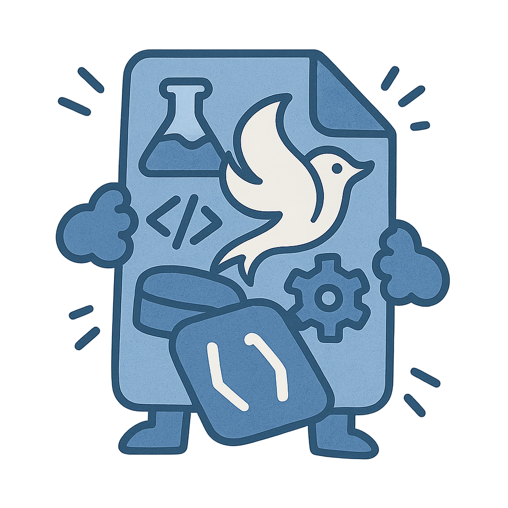
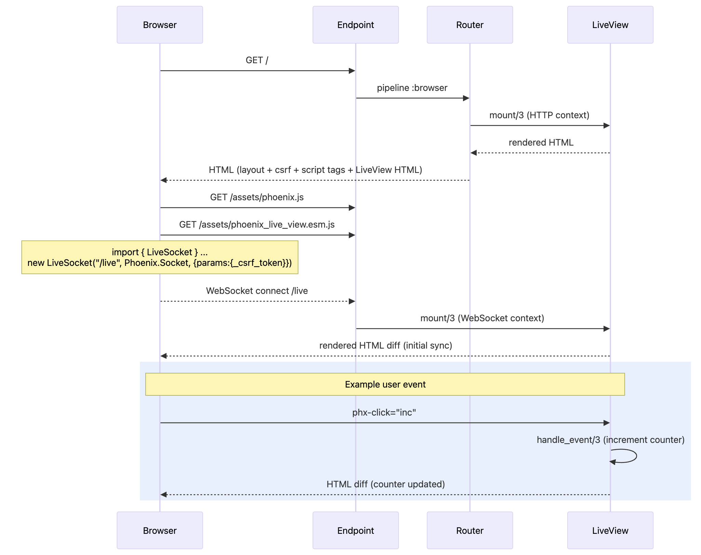
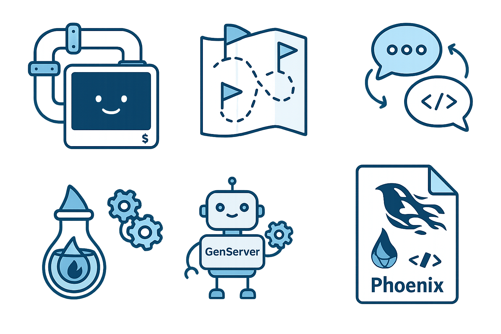

# From CLI to LiveView 🚀
## Adding a web UI to a **legacy** tool
### While showing off a bunch of nifty Elixir things
<!-- class: invert -->


---

<!-- footer: " " -->
# Before

<!-- class: invert -->


---

# After




---

## The Plan

* Learn to use Elixir **Ports** to interact with an external process.
* Micro introduction to **GenServers**
* Building a **single-file Phoenix LiveView** app
* Make it *live* with **Phoenix PubSub**


---

# Ports

> Because Elixir can't do everything (yet)

- A Port connects BEAM to an OS process.
- You send/receive messages; the OS process reads/writes stdin/stdout.
- Safer than NIFs; crashes don't take down the VM.
 


---

## Ports: Raw Usage

```elixir
# Start an interactive process
port = Port.open({:spawn, "cat"}, [:binary])

# Send data to stdin
Port.command(port, "Hello from Elixir!\n")

# Read from stdout
receive do
  {^port, {:data, data}} ->
    IO.puts("Got back: #{data}")
end

# Cleanup
Port.close(port)
```

---

# WTF is a GenServer?

**Why do we need this?**
In Elixir, everything is immutable - no global variables to mutate!

Think of it as a separate process that:
- **Holds state** (idiomatic way to hold global state)
- **Receives messages** (Call/Cast)
- **Processes requests** (serially)
- **Stays alive** (supervision)


---


```elixir
defmodule Counter do
  use GenServer

  # Client API (what others call)
  def start_link(_), do: GenServer.start_link(__MODULE__, 0, name: __MODULE__)
  def increment, do: GenServer.cast(__MODULE__, :increment)  # Fire & forget
  def get_count, do: GenServer.call(__MODULE__, :get_count)  # Wait for reply

  # Server callbacks (what runs inside)
  def init(initial_count) do
    {:ok, initial_count}  # State is just a number
  end

  def handle_cast(:increment, count) do
    {:noreply, count + 1}  # No reply, just update state
  end

  def handle_call(:get_count, _from, count) do
    {:reply, count, count}  # Reply with count, keep state
  end
end

# Usage:
Counter.start_link([])  # Usually started by supervisor
Counter.increment()     # Returns :ok immediately
Counter.increment()     # Returns :ok immediately
Counter.get_count()     # Returns 2 (waits for response)
```

---

## Why put my Port in a GenServer?

**Without GenServer:**
```elixir
port = Port.open(...)  # Who owns this?
# If this process crashes, port becomes orphaned
# How do other processes access this port?
# Where do I store my buffer and partial line data?
```

**With GenServer:**
```elixir
PortManager.get_lines() # Clean API for everyone
# State (partial chunks, buffer) lives in GenServer
# Port cleanup handled automatically
```

---

```elixir
defmodule SimplePortServer do
  use GenServer

  def start_link(opts \\ []), do: GenServer.start_link(__MODULE__, opts, name: __MODULE__)
  def get_chunks, do: GenServer.call(__MODULE__, :get_chunks)

  @impl true
  def init(_opts) do
    Port.open({:spawn_executable, "./execute-sync"}, [ :binary, :stderr_to_stdout, {:args, ["s"]} ])
    {:ok, %{chunks: []}}  # Store recent chunks
  end

  @impl true
  def handle_info({_port, {:data, chunk}}, state) do
    IO.puts("CHUNK: #{inspect(chunk)}")
    {:noreply, %{state | chunks: [chunk | state.chunks] |> Enum.take(10)}
  end

  @impl true
  def handle_call(:get_chunks, _from, state) do
    {:reply, Enum.reverse(state.chunks), state}
  end
end
```

---


---

## GenServer: own the Port and state

Responsibilities:
- Start the external process
- Accumulate chunks -> broadcast lines
- Store N lines in buffer
- Track online/offline
- Provide a simple API (start/stop/status/get_buffer)

<!--
---

```elixir
defmodule LogStreamer do
  use GenServer
  @name __MODULE__
  @topic "logs:execute_sync"
  @max_lines 20

  # Public API
  def start_link(_), do: GenServer.start_link(__MODULE__, :ok, name: @name)
  def get_buffer, do: GenServer.call(@name, :get_buffer)

  # GenServer callbacks
  def init(:ok) do
    state = %{port: nil, buffer: [], acc: ""}
    send(self(), :ensure_started)
    {:ok, state}
  end

  @impl true
  def handle_call(:get_buffer, _from, state) do
    {:reply, state.buffer, state}
  end

  def handle_info({port, {:data, chunk}}, %{port: port, acc: acc} = state) do
    # Split chunks into lines, handle partial lines
    parts = String.split(acc <> chunk, "\n")
    {complete, rest} = case List.last(parts) do
      "" -> {Enum.drop(parts, -1), ""}  # Ended with newline
      last -> {Enum.drop(parts, -1), last}  # Partial line
    end

    # Broadcast and buffer each complete line
    new_buffer = Enum.reduce(complete, state.buffer, fn line, buf ->
      clean = String.trim_trailing(line, "\r")
      IO.puts({:log_line, clean}) # PLACEHOLDER
      [clean | buf] |> Enum.take(@max_lines)
    end)

    {:noreply, %{state | acc: rest, buffer: new_buffer}}
  end
end
```
-->

---

# What is Phoenix?

- Awesome web framework for Elixir
- Mix project with multiple directories
- Asset pipeline (esbuild, tailwind, etc.)
- Database migrations, schemas, contexts
- Tons of generated boilerplate


---

# Why *single-file* Phoenix?
- Just the essentials for a LiveView app
- No build tools or asset pipeline
- Perfect for demos and learning
- Perfect for quick repros
- See how the pieces actually fit together



---


```elixir
# Dependencies
Mix.install([
  {:phoenix, "~> 1.8"},
  {:phoenix_live_view, "~> 1.0"},
  {:bandit, "~> 1.6"},  # HTTP server
  {:phoenix_html, "~> 4.0"}, # HEEX Templates
  {:jason, "~> 1.4"} # Jason
])

# The web server entry point (infrastructure) 
defmodule DemoEndpoint do
  # Receives HTTP requests, routes them.  
end

# URL routing and request pipelines (application logic)
defmodule DemoRouter do 
  # Maps URLs to LiveViews
end

# Our actual UI component
defmodule CounterLive do
  # Stateful server-rendered component
end

# Configuration and startup
Application.put_env(:demo, DemoEndpoint, [...])
{:ok, _} = Supervisor.start_link([DemoEndpoint], strategy: :one_for_one)
Process.sleep(:infinity)
```

---

## Endpoint: Infrastructure-level Concerns

```elixir
defmodule DemoEndpoint do
  use Phoenix.Endpoint, otp_app: :demo

  # WebSocket connection for LiveView
  socket "/live", Phoenix.LiveView.Socket

  # Serve JS files from deps
  plug Plug.Static,
    at: "/assets",
    from: {:phoenix, "priv/static"},
    only: ~w(phoenix.js)

  plug Plug.Static,
    at: "/assets",
    from: {:phoenix_live_view, "priv/static"},
    only: ~w(phoenix_live_view.esm.js)

  # Session management
  plug Plug.Session, store: :cookie, key: "_demo"

  # Send requests to router
  plug DemoRouter
end
```

---

## Router: Application Logic & URL Mapping

```elixir
defmodule DemoRouter do
  use Phoenix.Router
  import Phoenix.LiveView.Router

  # Middleware pipeline for browsers
  pipeline :browser do
    plug :accepts, ["html"]
    plug :fetch_session
    plug :fetch_live_flash
    plug :put_root_layout, html: {__MODULE__, :root}
  end

  # Route "/" to our LiveView
  scope "/" do
    pipe_through :browser
    live "/", CounterLive
  end

  # Minimal HTML wrapper
  def root(assigns) do
    ~H"""
    <html>
      <head>
        <script src="/assets/phoenix.js"></script>
        <script src="/assets/phoenix_live_view.esm.js" type="module"></script>
      </head>
      <body><%= @inner_content %></body>
    </html>
    """
  end
end
```

---


<!-- class: invert -->

## LiveView: Stateful Components

```elixir
defmodule CounterLive do
  use Phoenix.LiveView

  # Initialize state
  def mount(_params, _session, socket) do
    {:ok, assign(socket, count: 0)}
  end

  # Handle events from browser
  def handle_event("inc", _params, socket) do
    {:noreply, update(socket, :count, &(&1 + 1))}
  end

  # Render HTML (no CSS, keeping it ugly!)
  def render(assigns) do
    ~H"""
    <div>
      <h1>Count: <%= @count %></h1>
      <button phx-click="inc">+1</button>
    </div>
    """
  end
end
```

---

<!-- class: normal -->



---

<!-- class: invert -->
# PubSub

- One process broadcasts, many can listen
- Decouples producers from consumers
- No need to track who's listening
- Works across Elixir nodes!
- Built into Phoenix!


---

```elixir
# In your GenServer - broadcast when something happens
def handle_info({port, {:data, line}}, state) do
  # Process the chunk into a line...
  Phoenix.PubSub.broadcast(
    Demo.PubSub,           # The PubSub server
    "logs:updates",        # Channel name
    {:new_line, line}      # Message to send
  )
  {:noreply, state}
end

# In your LiveView - subscribe and handle messages
def mount(_params, _session, socket) do
  if connected?(socket) do
    Phoenix.PubSub.subscribe(Demo.PubSub, "logs:updates")
  end
  {:ok, assign(socket, lines: [])}
end

def handle_info({:new_line, line}, socket) do
  {:noreply, update(socket, :lines, &[line | &1])}
end
```

This is how multiple browser tabs can all show the same live data!

---

## Put it all together

- OTP GenServer wraps the Port and emits lines, and stores buffer (last N lines)
- LiveView renders and updates without custom JS
- Single file app because... why not!
- Phoenix PubSub pushes log lines from CLI app to **all** connected web viewers



---


---

# Takeaways

- Ports are a great option to talk to external processes
- GenServer are great for global state / wrapping ports
- Single-file Phoenix is handy for demos and small apps
- PubSub is the easy way to keep multiple browser windows updated when things happen.

